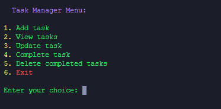

# Python Task Manager

A simple command-line task manager written in Python.


## Features

- **Add Task**: Add a new task to the list.
- **View Tasks**: Display the current list of tasks with their completion status.
- **Update Task**: Modify the details of an existing task (In Progress).
- **Complete Task**: Mark a task as completed (In Progress).
- **Delete Completed Tasks**: Remove all completed tasks from the list.

## Usage

1. **Add Task**
    - Enter the name of the task when prompted. Ensure it's not empty.

2. **View Tasks**
    - Display the current tasks with their completion status.

3. **Update Task**
    - Choose the task number you want to update. (In Progress)

4. **Complete Task**
    - Choose the task number you want to mark as complete. (In Progress)

5. **Delete Completed Tasks**
    - Remove all completed tasks from the list.

6. **Exit**
    - Exit the program.

## How to Run

1. Ensure you have Python 3.12 installed.

2. Clone this repository:
    ```bash
    git clone https://github.com/sondercs/Python-Task-Manager.git
    cd Python-Task-Manager
    ```

3. Run the script:
    ```bash
    python task_manager.py
    ```

## Python Version

This project uses Python version 3.12.

    
    
